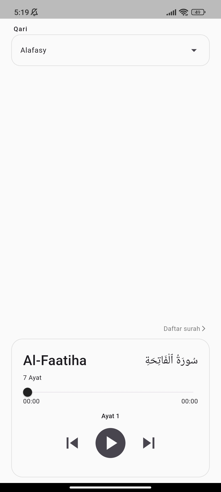
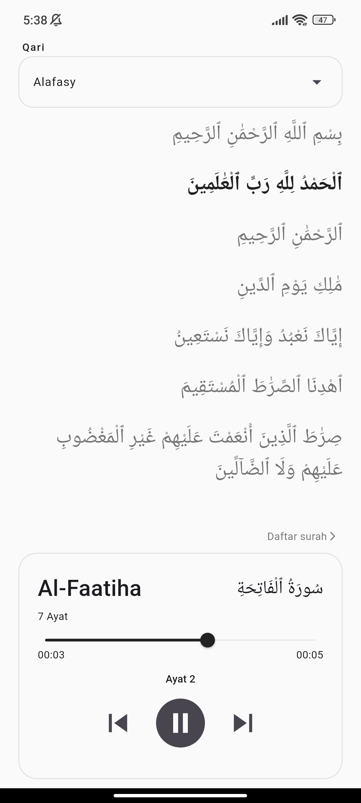
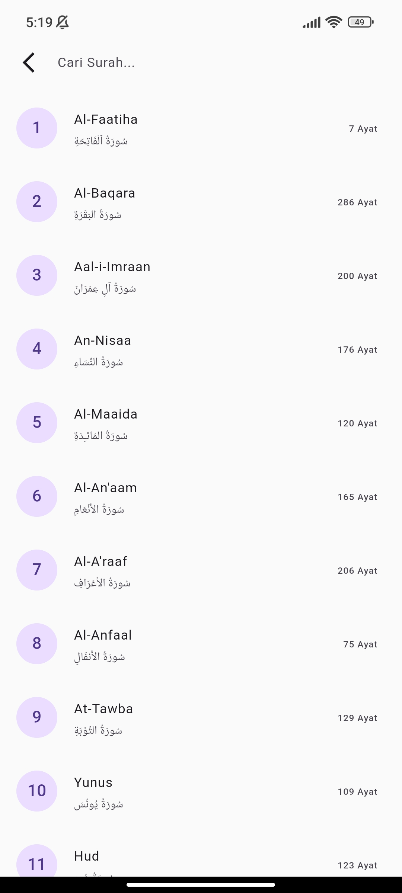

# Tilawah App

A Flutter-based Quran audio player application that allows users to search Surahs and listen to Quran recitations. The application provides audio playback controls, progress tracking, and seeking functionality using a clean and modular architecture.

## Features

* Search Surah by name
* Search Reciter (Qari) by name
* Play Quran audio
* Pause and Resume playback
* Audio progress tracking
* Seek audio position using slider
* Display current playback position
* Display total audio duration
* Current Ayah indicator
* Responsive and simple user interface

## Tech Stack

### Framework

* Flutter

### State Management

* GetX

### Audio Player

* just_audio

### Networking

* Dio

### API

* AlQuran Cloud API

## Project Structure

```text
lib/
├── app/
├── config/
├── features/
│   └── play_audio/
│       ├── data/
│       │   ├── datasource/
│       │   └── model/
│       │
│       ├── domain/
│       │   ├── entities/
│       │   └── repository/
│       │
│       └── presentation/
│           ├── getx/
│           ├── pages/
│           └── widgets/
├── shared/
```

## Architecture

This project uses a feature-based architecture, where application modules are organized by feature to improve maintainability, scalability, and separation of concerns.

### Data Layer

Responsible for:

* API communication
* Model mapping
* Repository implementation

### Domain Layer

Responsible for:

* Business entities
* Repository contracts

### Presentation Layer

Responsible for:

* UI components
* State management using GetX
* User interactions

## Screenshots

<p align="center">
  
  
  
</p>

For more detailed documentation, including application screenshots and demo videos, please visit: [Google Drive](https://drive.google.com/drive/folders/1B1-dO2pF0x0ZYvtELtlbryHGLXNsgFdX?usp=sharing).

## Getting Started

### Clone Repository

```bash
git clone https://github.com/Sidqii/tilawah-audio-player.git
```

### Install Dependencies

```bash
flutter pub get
```

### Run Application

```bash
flutter run
```

## Dependencies

```yaml
get: ^4.7.3
dio: ^5.9.2
just_audio: ^0.10.5
flutter_launcher_icons: ^0.14.4
```